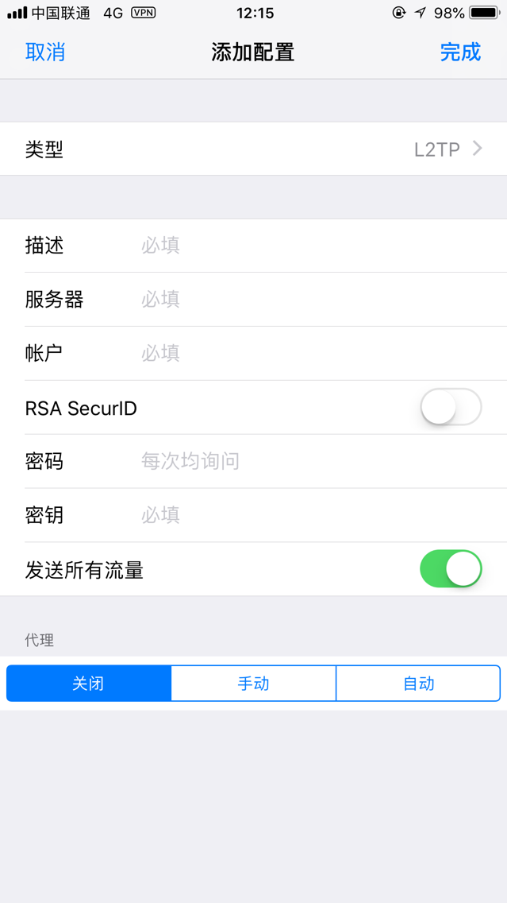
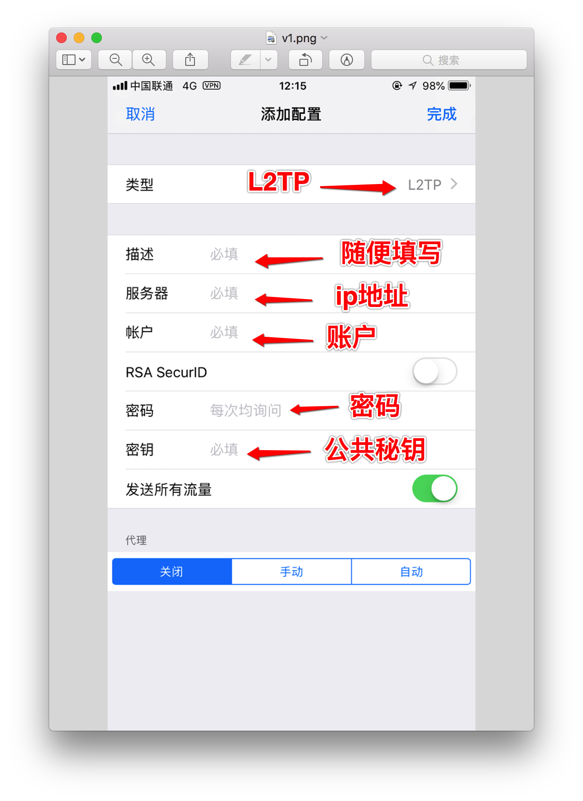
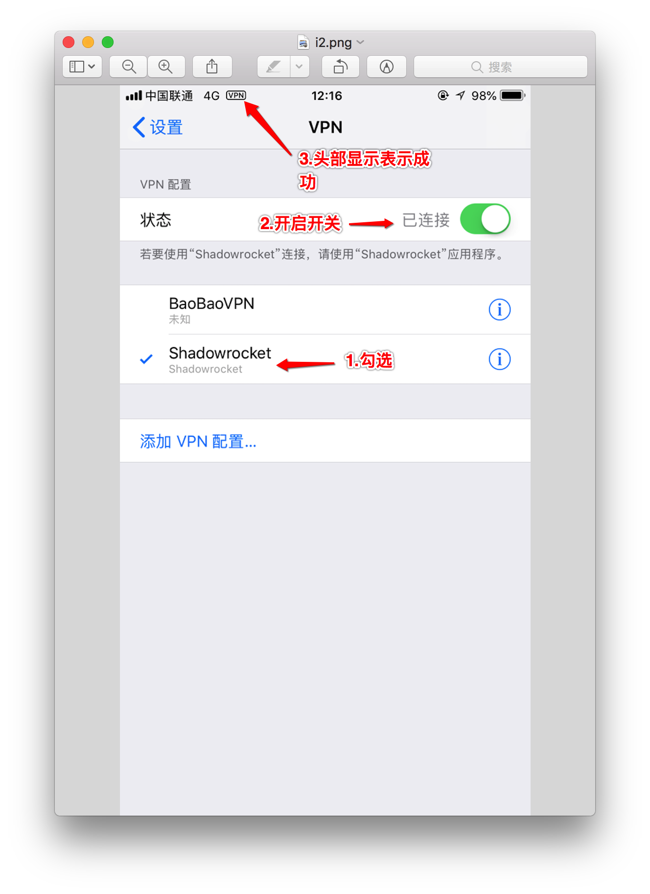

# L2TP
# L2TP客户端安装方法

# 1. Android设置方法 
        

# 2. iPhone设置方法 

- iOS设置方法可参考 
> http://service.tp-link.com.cn/detail_article_715.html

# 3. Windows设置方法
- Windows 7设置方法可参考 
> http://service.tp-link.com.cn/detail_article_725.html

- Windows 8、10设置方法可参考
> http://service.tp-link.com.cn/detail_article_752.html

- Windows XP设置方法可参考
> http://service.tp-link.com.cn/detail_article_754.html